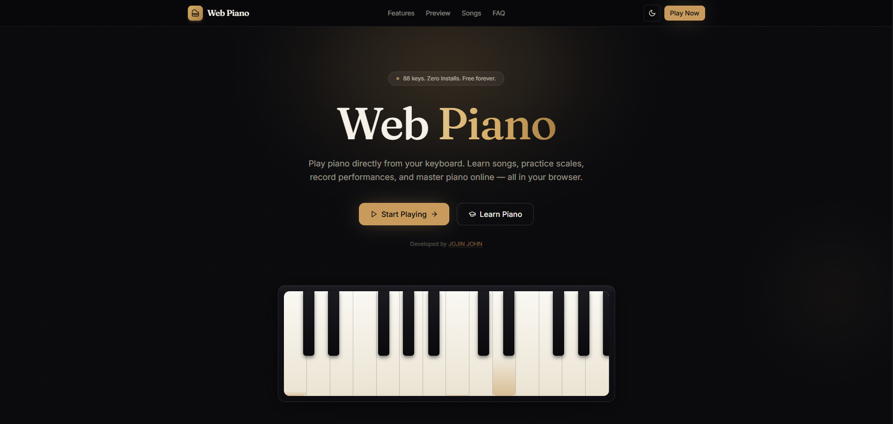

<div align="center">

# Web Piano

Play piano directly from your keyboard. Learn songs, practice scales, record performances, and master piano online — all free, in your browser.

**88 keys. Zero installs. Free forever.**

---

<a href="https://webpiano-three.vercel.app/"></a>
<a href="https://www.linkedin.com/in/jojin-john-74386b34a/"></a>

</div>

---

## Features

<div align="center">

| | | |
|:---:|:---:|:---:|
| **Keyboard Support** | **Real Piano Sounds** | **MIDI Keyboard Input** |
| Play with your computer keyboard mapped across two octaves | Sampled from a genuine grand piano | Connect a real USB/MIDI keyboard |
| **Record & Export** | **Sheet Music Display** | **28 Songs** |
| Capture performances and export as MIDI, MP3, JSON, or CSV | See notes on a treble clef staff as you play | Easy to Master difficulty levels |
| **Chord Detection** | **Practice Mode** | **Loop Practice** |
| See chords and scales in real time | Play-along scoring with accuracy tracking | Loop any section to practice repeatedly |
| **Metronome** | **Count-in Recording** | **Progress Tracker** |
| Audio click + visual beat flash | 4-beat countdown before recording | Save best scores and completion status |
| **Learn Mode** | **PWA / Installable** | **Dark Mode** |
| 6 guided interactive lessons | Install as app on phone or desktop | Easy on the eyes for late-night sessions |
| **Fully Responsive** | | |
| Works on desktop, tablet, and phone | | |

</div>

---

## Live Demo

<p align="center">
  <a href="https://webpiano-three.vercel.app/">
    
  </a>
</p>

<p align="center">
  <a href="https://webpiano-three.vercel.app/"><b>Open Web Piano &rarr;</b></a>
</p>

---

## How It Works

```
  ┌─────────────┐     ┌─────────────┐     ┌─────────────┐
  │  Press a    │     │  Hear real  │     │  Learn &    │
  │  key        │────▶│  piano      │────▶│  practice   │
  │             │     │  sound      │     │             │
  └─────────────┘     └─────────────┘     └──────┬──────┘
                                                 │
                                                 ▼
                                          ┌─────────────┐
                                          │  Record &   │
                                          │  export     │
                                          │  MIDI       │
                                          └─────────────┘
```

1. **Press a key** — Use your computer keyboard (A, W, S, E, D...) or click the on-screen keys
2. **Hear real sound** — Audio samples from a genuine grand piano play instantly
3. **Learn & practice** — Follow lessons, play songs, or let the chord detector teach you
4. **Record & export** — Capture your performance and download as a standard MIDI file

---

## Song Library (28 Songs)

<div align="center">

| Difficulty | Songs |
|:---:|:---|
| **Easy** | Happy Birthday, Twinkle Twinkle, Mary Had a Little Lamb, Jingle Bells, Ode to Joy, London Bridge, Row Your Boat, Brahms' Lullaby, Minuet in G, Amazing Grace |
| **Medium** | Canon in D, Hedwig's Theme, Interstellar, River Flows in You, Clair de Lune, Clocks, Moonlight Sonata Theme |
| **Hard** | Für Elise, He's a Pirate, Moonlight Sonata, Star Wars, Nokia Ringtone, Take On Me |
| **Master** | Flight of the Bumblebee, Nocturne Op.9 No.2, Turkish March, The Entertainer, La Vie en Rose |

</div>

---

## Keyboard Shortcuts

<div align="center">

| Lower Octave | | Upper Octave | |
|:---:|:---:|:---:|:---:|
| **A** = C | **K** = C | **1** = C | **7** = B |
| **W** = C# | **O** = C# | **Q** = C# | **Z** = D# |
| **S** = D | **L** = D | **2** = D | **X** = F# |
| **E** = D# | **P** = D# | **3** = D# | **C** = G# |
| **D** = E | **;** = E | **4** = E | **V** = A# |
| **F** = F | | **5** = F | |
| **T** = F# | | **6** = F# | |
| **G** = G | | **7** = G | |
| **Y** = G# | | | |
| **H** = A | | | |
| **U** = A# | | | |
| **J** = B | | | |

**Space** = Sustain Pedal

</div>

---

## Tech Stack

<div align="center">

| | |
|:---:|:---:|
| **Next.js 15** | App Router, React Server Components |
| **TypeScript** | Fully typed, no `any` |
| **Tailwind CSS** | Custom design tokens, dark/light themes |
| **Framer Motion** | Animations and page transitions |
| **Tone.js** | Sampled grand piano audio engine |
| **Web MIDI API** | Real MIDI keyboard support |

</div>

---

<div align="center">

**All Rights Reserved** &copy; 2026 [JOJIN JOHN](https://www.linkedin.com/in/jojin-john-74386b34a/)

No part of this software may be copied, modified, distributed, or used without permission.
See [LICENSE](LICENSE) for full terms.

---

Built by [JOJIN JOHN](https://www.linkedin.com/in/jojin-john-74386b34a/)

</div>
